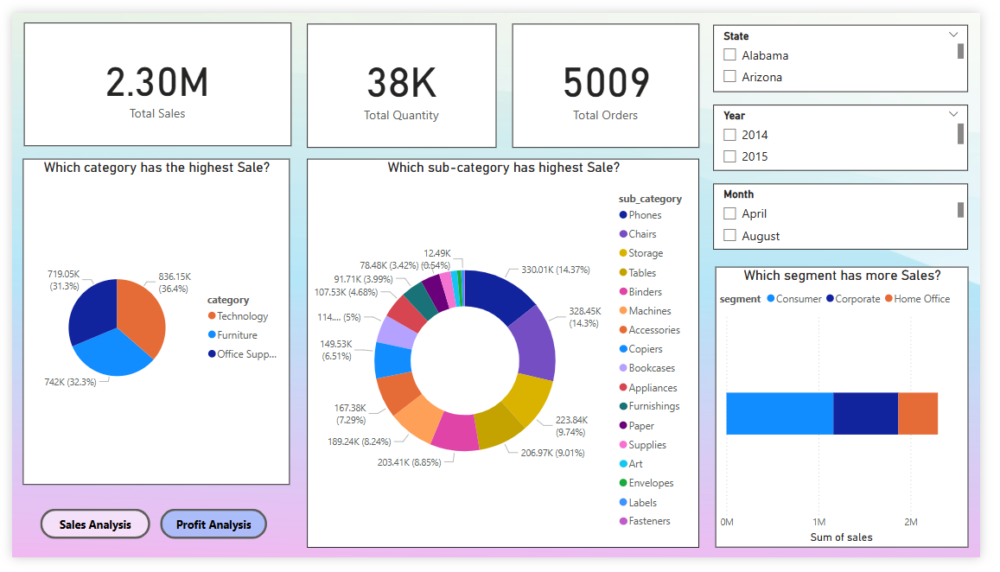
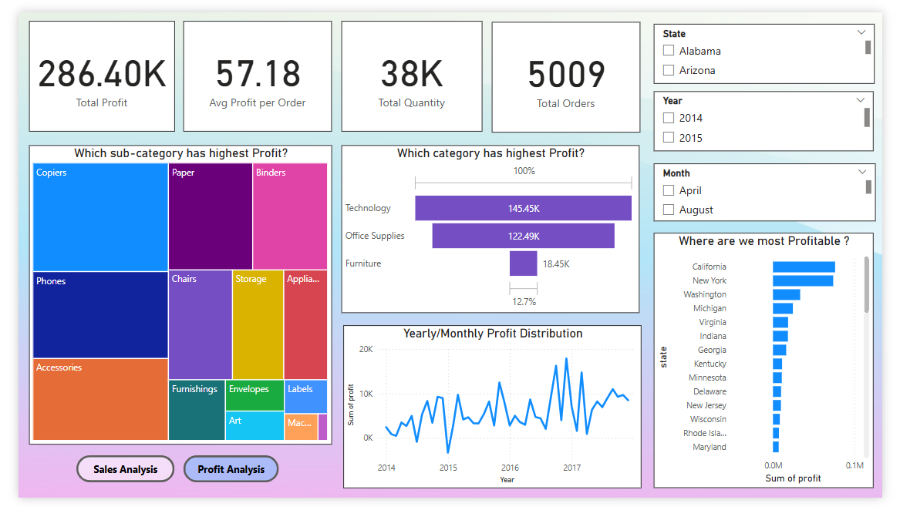

# 🛒 Sales Analysis Dashboard

A comprehensive Power BI dashboard for analyzing and visualizing sales data across multiple dimensions such as time, region, product categories, and more.

## 📊 Overview

This project provides an interactive dashboard built using **Power BI** to help stakeholders make data-driven decisions based on sales performance. The dashboard includes insights into:

- Monthly and yearly sales trends
- Top-performing products and regions
- Sales by category and sub-category
- Customer segmentation
- Profitability analysis

## 📌 Features

- Dynamic slicers and filters for better exploration
- Visual storytelling with KPIs, bar charts, line graphs, and maps
- Data transformation and modeling done within Power BI
- Region-wise and segment-wise breakdown of sales and profit

## 📂 Dataset Description

The dataset used is **Sample Superstore**, which contains fields like:

- Order ID, Order Date, Ship Date
- Customer ID, Segment, Country, Region
- Product Category, Sub-Category, Product Name
- Sales, Quantity, Discount, Profit

## 📷 Dashboard Preview

> *(Include a screenshot of the dashboard here for better visualization)*

## 🛠 Tools Used

- **Power BI Desktop**
- **Microsoft Excel** (optional for data preprocessing)
- **Sample Superstore dataset**

## 📌 Use Cases

- Business performance tracking
- Sales team KPI monitoring
- Strategic planning based on regional/product trends
- Data visualization portfolio project

